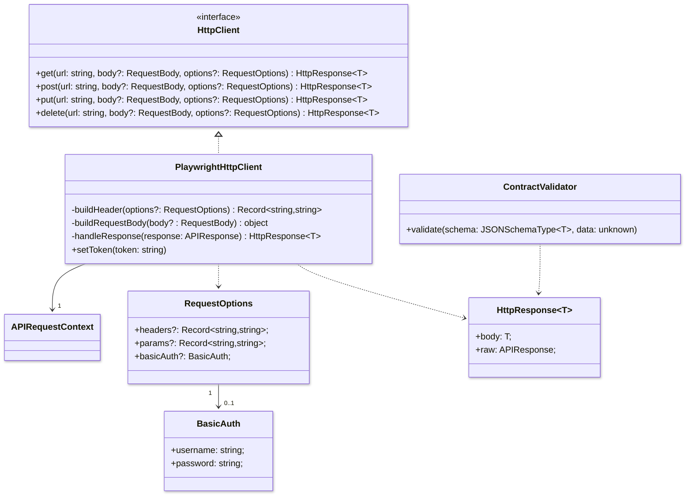

# HTTP Client Architecture

The following diagram shows the relationships between the core HTTP abstractions.

```mermaid
---
config:
  theme: mc
  look: neo
  fontFamily: '''Source Code Pro Variable'', monospace'
  themeVariables:
    fontFamily: '''Source Code Pro Variable'', monospace'
---
classDiagram
direction TB
    class HttpClient {
	    +get(url: string, body?: RequestBody, options?: RequestOptions) HttpResponse~T~
	    +post(url: string, body?: RequestBody, options?: RequestOptions) HttpResponse~T~
	    +put(url: string, body?: RequestBody, options?: RequestOptions) HttpResponse~T~
	    +delete(url: string, body?: RequestBody, options?: RequestOptions) HttpResponse~T~
    }

    class PlaywrightHttpClient {
	    -buildHeader(options?: RequestOptions) Record~string,string~
	    -buildRequestBody(body? : RequestBody) object
	    -handleResponse(response: APIResponse) HttpResponse~T~
	    +setToken(token: string)
    }

    class APIRequestContext {
    }

    class ContractValidator {
	    +validate(schema: JSONSchemaType~T~, data: unknown)
    }

    class RequestOptions {
	    +headers?: Record~string,string~;
	    +params?: Record~string,string~;
	    +basicAuth?: BasicAuth;
    }

    class BasicAuth {
	    +username: string;
	    +password: string;
    }

    class HttpResponse~T~ {
	    +body: T;
	    +raw: APIResponse;
    }

	<<interface>> HttpClient

    HttpClient <|.. PlaywrightHttpClient
    PlaywrightHttpClient "1" --> "1" APIRequestContext
    PlaywrightHttpClient ..> RequestOptions
    PlaywrightHttpClient ..> HttpResponse
    ContractValidator ..> HttpResponse
    RequestOptions "1" --> "0..1" BasicAuth
```